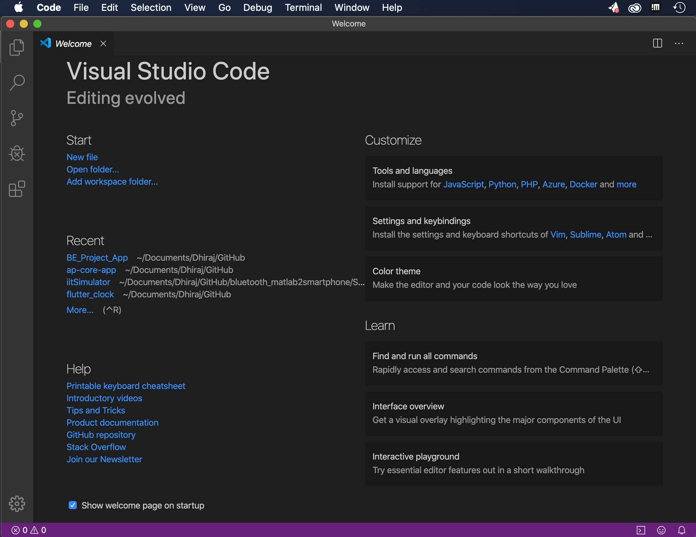

# Dhiraj Prakash Jain

___
## Mahad, Raigad, India
Mahad is a small town located in Raigad District. Raigad was the capital of great Indian warrior king Shivaji Maharaj. Mahad is well known for its "Chavdar lake" where Dr. Babasaheb Ambedkar(Freedom Fighter) did water satyagraha.

## Background 
___
I have completed my Associate and Bachelor's Degree in Computer Engineering from India. With proven leadership capabilities and passionate about programming, Android and Web Application Development I have led multiple projects to completion. I did two internships, one at Aalborg university in Copenhagen, Denmark as leader for "Smart cities in India" project and second at Prompt Info Service in Pune, India as Netwrok Administrator.

## Additional Info
I am very good at life hacks!! I can fix anything around me which is not working or broken. And Key to this uniqueness is I believe in :

"I never lose, it's either I win or I learn"
___
## Installation of PowerShell Core for Mac (ssh and bash)

___
## Package Managers for MacOS

___
## Install IDE editor

___
## Badges
Git Version

Git Tutorial

