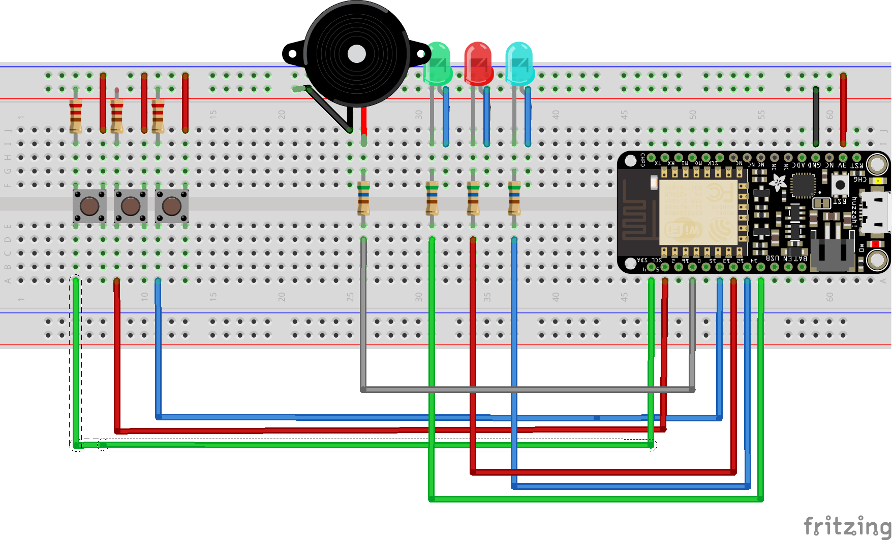

# Simon Game
Simon is an electronic game of memory skill invented by Ralph H. Baer and Howard J. Morrison, working for toy design firm Marvin Glass and Associates,with software programming by Lenny Cope. The device creates a series of tones and lights and requires a user to repeat the sequence. If the user succeeds, the series becomes progressively longer and more complex. Once the user fails or the time limit runs out, the game is over. 
Reference: https://en.wikipedia.org/wiki/Simon_(game)

## Hardware Requirements
* Adafruit Feather HUZZAH with ESP8266 WiFi
* 1x Breadboard-friendly SPDT Slide Switch
* 3x LEDs
* 1x Piezo Buzzer
* Jumper Wires
* 4x 560 ohm resistors
* 3x 220 ohm resistors
* USB

## Software Requirements
* Arduino IDE
* Adafruit Huzzah ESP8266 Board Library
    * Link: https://arduino.esp8266.com/stable/package_esp8266com_index.json
