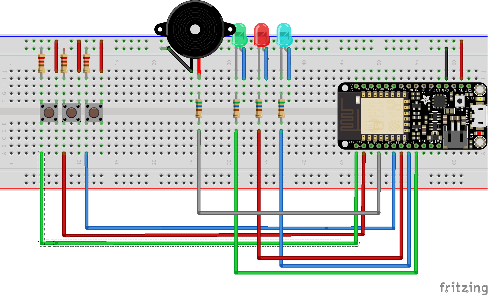
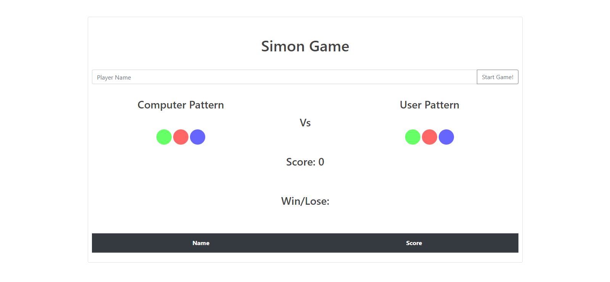

# Simon Game
Simon is an electronic game of memory skill invented by Ralph H. Baer and Howard J. Morrison, working for toy design firm Marvin Glass and Associates,with software programming by Lenny Cope. The device creates a series of tones and lights and requires a user to repeat the sequence. If the user succeeds, the series becomes progressively longer and more complex. Once the user fails or the time limit runs out, the game is over. 
Reference: https://en.wikipedia.org/wiki/Simon_(game)

## Hardware Requirements
* Adafruit Feather HUZZAH with ESP8266 WiFi
* 1x Breadboard-friendly SPDT Slide Switch
* 3x LEDs
* 1x Piezo Buzzer
* Jumper Wires
* 4x 560 ohm resistors
* 3x 220 ohm resistors
* USB

## Software Requirements
* Arduino IDE
* Adafruit Huzzah ESP8266 Board Library
    * Link: https://arduino.esp8266.com/stable/package_esp8266com_index.json

## How to deploy code on Adafruit Feather HUZZAH and Play the Simon Game
1. Open the file jain-dhiraj-assignment-wifi.ino
2. Change the SSID and Password with your own wifi SSID and Password.

--------Changes to be made in following code in the file--------

    * const char* ssid = "YOUR_SSID";
    * const char* password = "YOUR_PASSWORD";

---------------------------END----------------------------------

3. Upload the code and check the IP address for the board on Serial Console.
4. Open the browser and go to the IP adress of the Board. You should see the following page:

5. Enter the player name and then click on Start Game! button to start the game. There are three levels in the game and each game consists of 5 rounds. With each round you win your score gets increase by 1 and when you lose your game is over.

    Note without Entering the name you can't start the game.
6. After you start the game you will see the pattern of the computer on the screen and on the module, to win the game all you have to do is match the pattern with the computer pattern. 
7. While matching the pattern you will be able to see the color of led button you pushed on the screen.
8. After each complete game (win/lose) you will get your scores in below table with your name.