# Vagrant and Packer Lab
&nbsp;&nbsp;
## Part 1

#### Vagrant up Command for Centos/7

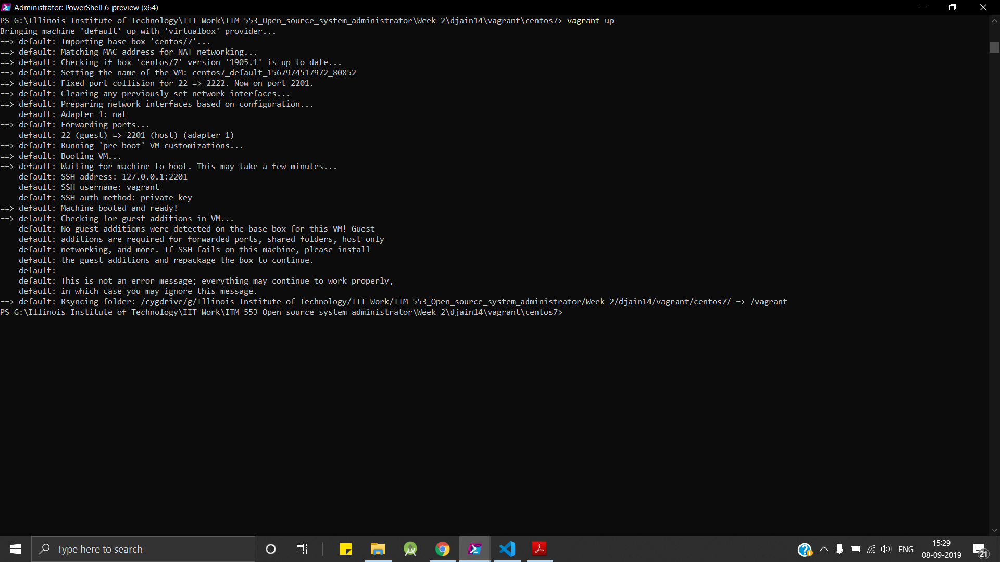
___

#### vagrant up Command for ubuntu/bionic64

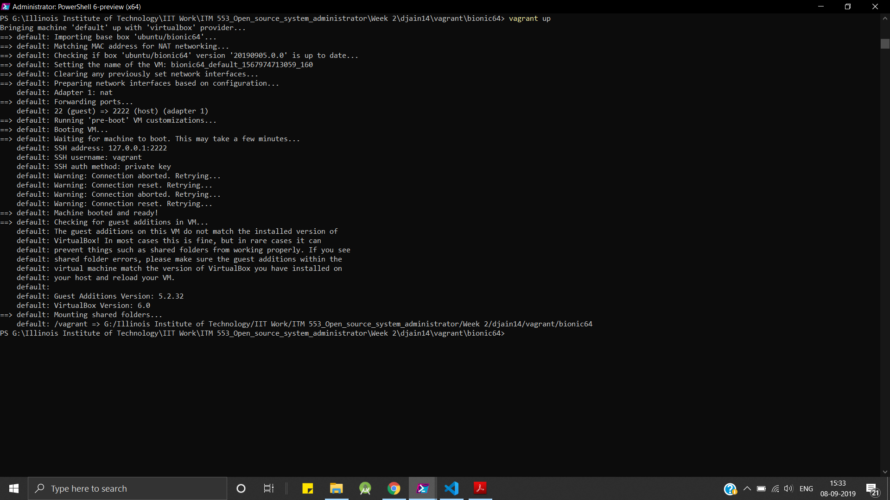
___

#### vagrant box list command

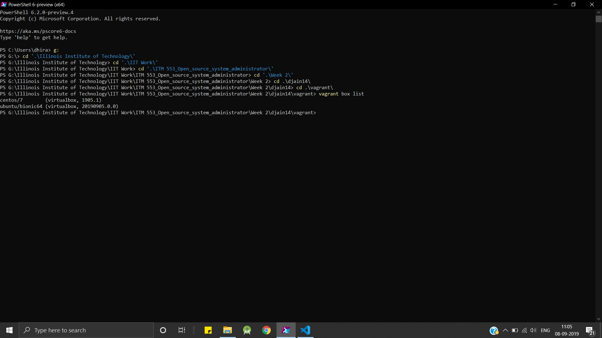
___

&nbsp;&nbsp;&nbsp;&nbsp;
## Part 2

#### free --giga command for centos-1810-vanilla

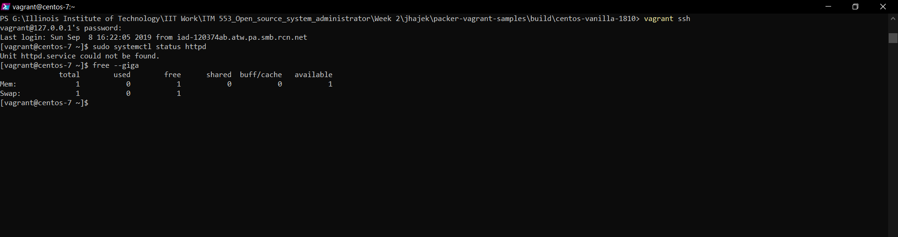
___

#### free --giga command for ubuntu-18043-vanilla

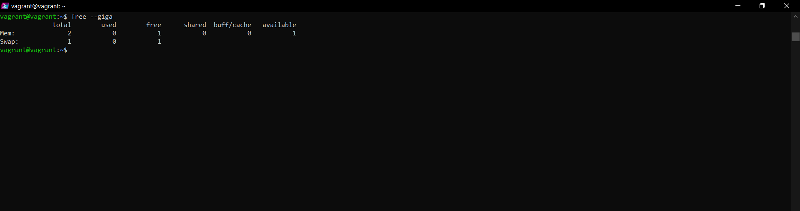
___

#### Vagrant box list command

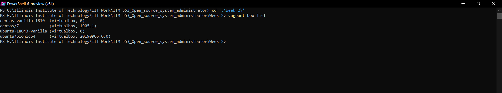
___
&nbsp;&nbsp;&nbsp;&nbsp;
## Part 3

#### Vagrant Boxes centos/7 and bionic64 memory adjustment to run at RAM(2048 MB)
#### Screenshot of free --giga command:

#### centos/7

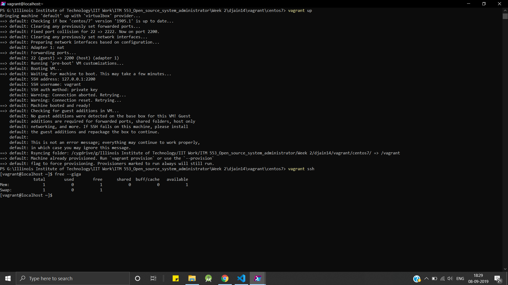
___

#### ubuntu/bionic64

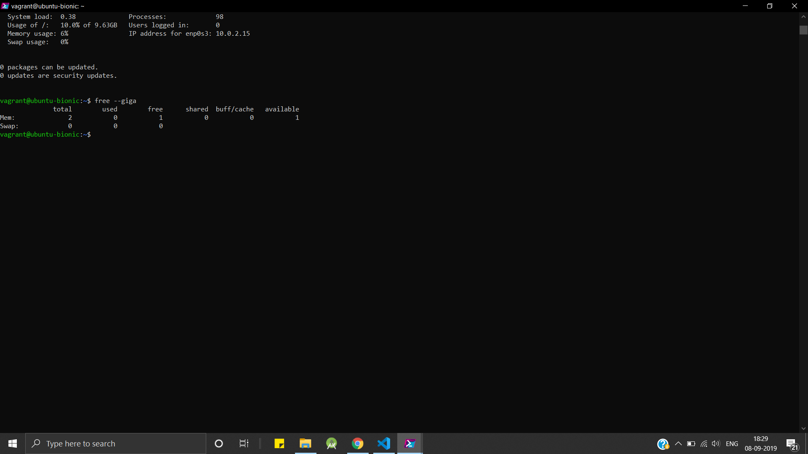
___
&nbsp;&nbsp;&nbsp;&nbsp;
## Part 4

#### sudo systemctl status apache2 command after installing apache2 on bionic64 and ubuntu-vanilla

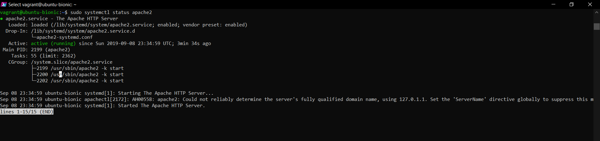

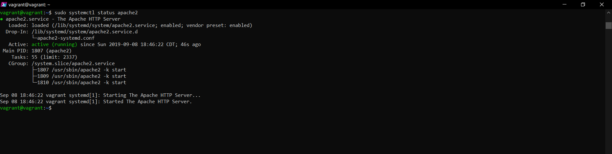
___

#### sudo systemctl status httpd command after installing httpd on centos/7 and centos-1810-vanilla

___

#### Vagrant destroy command on all four Boxes

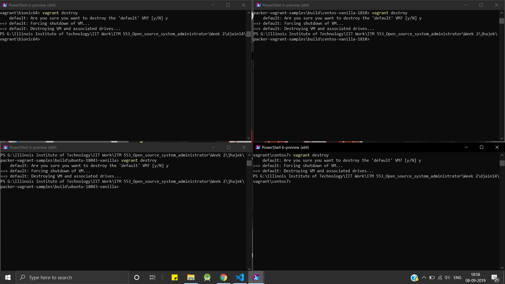
___

#### vagrant up command on all four Boxes

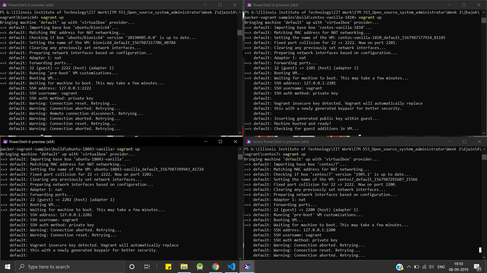
___

#### vagrant ssh command on all four Boxes 

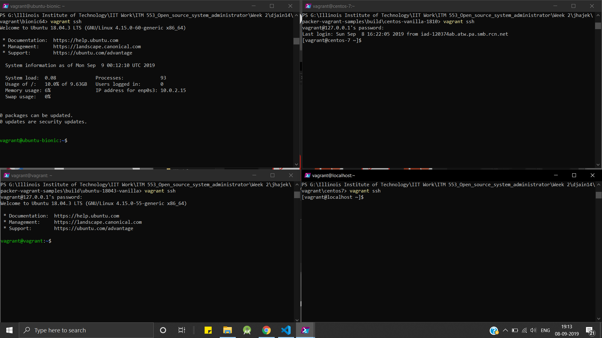
___

#### sudo systemctl status apache2 command on bionic64 and ubuntu-vanilla after vagrant destroy command

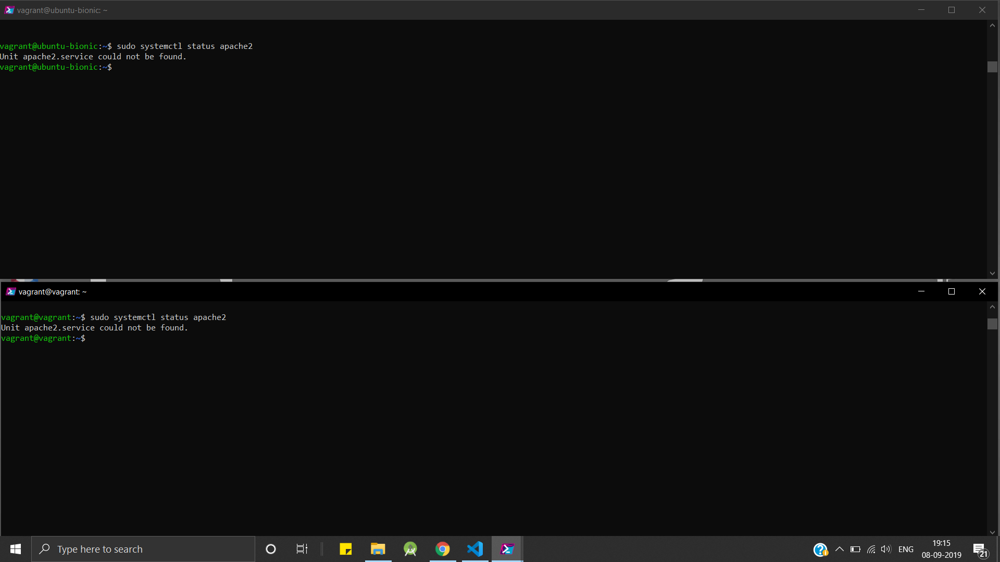
___

#### sudo systemctl status httpd command on centos/7 and centos-1810-vanilla after vagrant destroy command

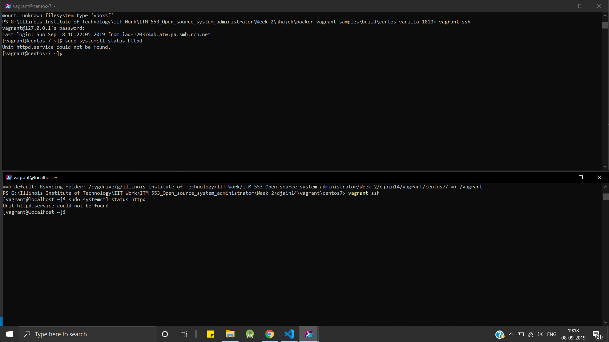
___
